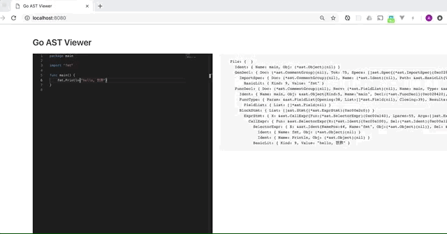

# astviewer

golang ast viewer using wasm.



## Getting Started

### Prerequisites

- Go 1.11+

### Installing

```
$ go get -u github.com/akito0107/astviewer/cmd/astviewer
```

and exec

```
$ astviewer
```

goto localhost:8080 via browser.

## Options

```sh
-p {number}  listen port (default=8080)
```
